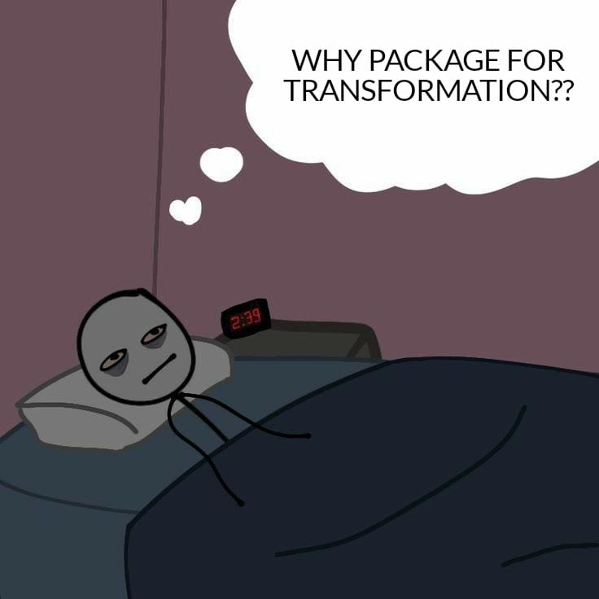
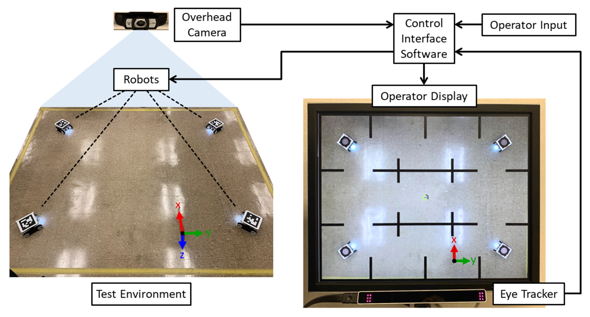
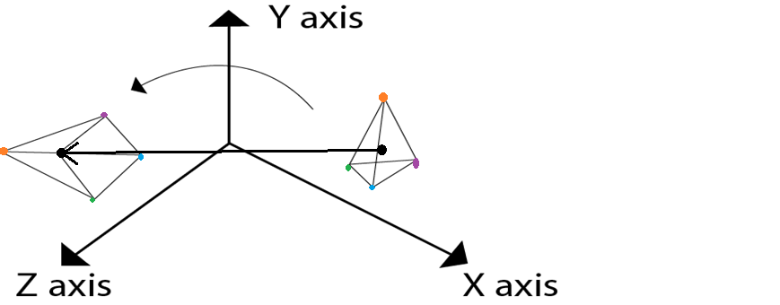

# Subpart-1 

<h2 align="center">RViz</h2>

**Visualisation** is the key which make robotics fun, Generally we want to see what the robot is seeing, how its joints, links are behaving while interacting with environment etc.... so for these purposes ROS has a package RViz(known as ROS Visualiser) to allow us to see and visualise all these things.

It allows us to....
 - See the image from the camera mounted on robot.
 - Visulaise and debug URDFs.
 - Odometry and Mapping of the environment.
 - set Markers
 - visulaise transformations 
 - and so on.......

Before moving further, see these Videos for Rviz Introduction and feel

[Rviz Introduction by The Construct](https://www.youtube.com/watch?v=yLwr5Zhr_t8&t=137s) 
[More indepth usage](https://www.youtube.com/watch?v=6pep5xB4pEU)

Don't Worry if you don't understand few terms, you learn about most of them as the camp progress. If you are unable to understand How we represent two frames and how we translate between them see [Simple Example](#simple_example) section first
 

Before moving further with RViz, let's first learn about **tf or transforms(transformations)**.

<h2 align="center">tf</h2>

In pybullet camp, you found an example of transformation i.e., **euler2quaternion** or **quaternion2euler**, but robotics is not just limited to it. To learn more about transformations in real world with robotics see [This video from Maryland University](https://www.youtube.com/watch?v=olmAyg_mrdI&list=PLZgpos4wVnCYhf5jsl2HcsCl_Pql6Kigk&index=2&t=837s)(Although this video is on quadrotors but nearly same math applies in all robotics field.)

In ROS, there is a seprate package which handles transformations, but one might be thinking...

I will leave the answer on [Kostas Danillidis-Proff at University of Pennsylvania](https://www.coursera.org/lecture/robotics-perception/rotations-and-translations-eTSMz)

In the video you can find how different transformations need to be consider just for a single camera. But real robotics applications not just limits to a camera but include sensors like [IMU](https://en.wikipedia.org/wiki/Inertial_measurement_unit), [GPS](https://en.wikipedia.org/wiki/Global_Positioning_System), [LaserScan](https://en.wikipedia.org/wiki/Laser_scanning), [Encoders](https://www.encoder.com/article-what-is-an-encoder), and many more like this can be included, Hence to make all sensor synchronized ROS reduces the overhead of managing transformations differently but made a compact way of handling these through tf package. Additionally, it can be extended for joints, links transformations as well and allows you to view your entire robot urdf and all its parent and child frames using TF_ViewFrames. 

To learn more thoroughly about it Refer [ROS-Wiki/tf](http://wiki.ros.org/tf).

Also you can look about RViz from [ROS-Wiki/RViz](http://wiki.ros.org/rviz)(Although i think it will be hard for some of you to understand it directly from wiki for now..).

Basically it helps you by providing a transformation (both rotation and translational) between two frame of references. 

## Simple examples

- Lets Say you have a overhead camera and you know the position of target and the robot from the cameras point of view But you have to move the robot which has a different coordinate system, Its obvious if we consider to just flip the axises of the camera coordinate from XYZ to ZYX axises we can directly control the robot

 

basically we did a matrix multiplication or a Rotation of the coordinates to get the Point of references. If you dont understand what a rotation matrix is just imagine it as a extention of your complex number multiplication that rotated a phaser to a desired angle, and to get a better Visualization of what this does then just have a look at the image below.

 

And for this case the rotation matrix is very simple

- Now lets consider a complex case where the point of references are not stationary Like in the robot given below lets say we wanted to climb stairs, And we have the coordinates of the stairs from the Center of Mass of the robot, If we have the task to keep only the front most leg on the stairs, We would need the coordinate of the stairs from the frame of reference of the toe, But this time the rotation and translation matrix is not constant like the previous examples as the position of the toe is changing relative to the Center of mass as the joint angles are changing So keeping this in mind we have first compute the forward Kinematics of the toes and then compute the translation and rotation matrix which is very hard considering your system may have multiple joints and multiple end effectors , In all this case the TF package comes in handy

 

## HANDS ON

Only seeing something don't make you master in it. so let's try some things by yourselves...

Run below Packages Step by Step to get the flavour of Rviz and tf.

P.S. -> We are not going indepth of the underlying code(As our aim is to give you a headstart on how these are useful and not telling about every knitty-gritty details), if one is willing he/she can go through it for better understanding

 - [Learning Urdf Step by Step](http://wiki.ros.org/urdf/Tutorials) - Although these concepts were taught in pybullet camp but here you will actually going to visulaise it in RViz-ROS. **Just Follow the steps as mentioned there and try to Run locally-> Learning URDF Step by Step Tutorial for first three section till now(Upto- Adding Physical and Collision Properties to a URDF Model).**
   
 - TF from ROS wiki [[1]](http://wiki.ros.org/tf/Tutorials/Introduction%20to%20tf) , [[2]](http://wiki.ros.org/tf/Tutorials/Writing%20a%20tf%20broadcaster%20%28C%2B%2B%29), [[3]](http://wiki.ros.org/tf/Tutorials/Adding%20a%20frame%20%28C%2B%2B%29), [[4]](http://wiki.ros.org/tf/Tutorials/tf%20and%20Time%20%28C%2B%2B%29),, [[5]](http://wiki.ros.org/tf/Tutorials/Time%20travel%20with%20tf%20%28C%2B%2B%29) Go through all these tutorials to get a good understanding of tf
       

## Task for this Subpart

From Pybullet camp, you are familiar with building urdfs(assuming only static models). In this task your aim is to build the geometrical tags for the below robot(Original Version developed by RoboREG-adversarial_cars team [here](https://github.com/Robotics-Club-IIT-BHU/gym-adversarial-cars/tree/main/adversarial-gym/adversarial_cars/envs/rsc/car)) and visulaise it in RViz and debug there.

 
<b>Credits for this URDF- gym-adversarial_cars team - RoboREG</b>

- [ ] You can use the above link to access the urdf and use this link [Visulaising urdf tutorial from ROS for your urdf](http://wiki.ros.org/urdf/Tutorials/Building%20a%20Visual%20Robot%20Model%20with%20URDF%20from%20Scratch) to get started with visualizing it. The next task is to setup TF with this urdf [TF with Robot](http://wiki.ros.org/navigation/Tutorials/RobotSetup/TF), Here they have used a laser but what i need you to do is setup tf from baselink to each wheels.

- [ ] After setting up Tf to test it out you have to print the coordinates, and orientation (prefered in euler angles) of the point [1,1,0] from 3 different frame of references (i.e., From the baselink, from left wheel, from right wheel) you may choose to add more frames but in the submission of this task you have to make a clear video while demonstrating your code running and the urdf spawnned on RVIZ. We strictly prefer the use of TF to complete this task but you are more than welcome to do it by hand but it is neccesary for using TF for the next task. 

- [ ] After you have used TF we just want you to submit the pdf generated using TF Frames, whos syntax can be found here.[Debugging tools](wiki.ros.org/tf/Debugging%20tools)

Happy `make`ing!!

Submission for all this task would be on 22 July EOD (Not negotiable).
