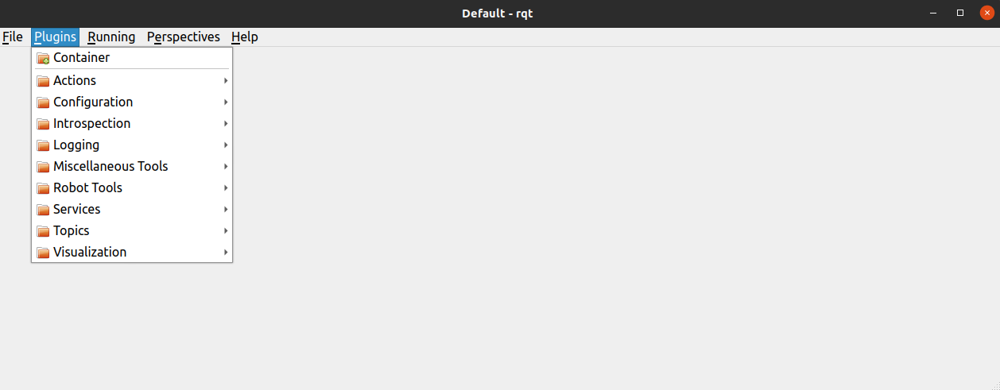
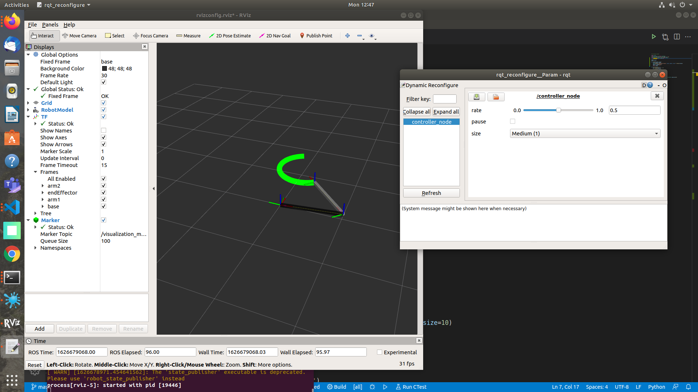
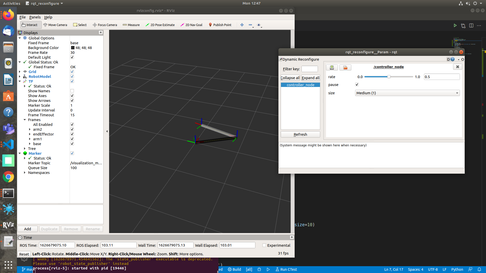

```cpp
if("completed Subpart-1")
    cout<<"HURRAY enter Subpart-2"<<"\n";
else
    cout<<"Go back to Subpart-1 and complete it first"<<"\n";
```

# Subpart-2

In this Subpart we will discuss a common concern with programming i.e., degugging and how ROS have some awesome tools to address it.

<h2 align="center">RQT</h2>

RQt runs in the same way as a node.


```bash
# start roscore 
~$ roscore
```
```bash
# in another terminal run
-$ rqt
```
A similar window of this type will open


RQT have different components varying from viewing node Graphs, logging errors/warnings, plotting variables, viewing images from camera on bot and other things. **We will go through three of them rqt_graph, rqt_plot, rqt_logging one by one**.

### 1. rqt_graph

Rqt graph is a GUI plugin from the Rqt tool suite. With rqt graph you can visualize the ROS graph of your application. On one window you can see all your running nodes, as well as the communication between them. The nodes and topics will be displayed inside their namespace.

**Why using rqt graph**?

When you develop with ROS you usually organize your work into packages and nodes. As your application grows (more sensors, more actuators, more ways to control your robot, …), so does your code base. So, you end up with many nodes and topics, and it might become harder to debug. Using rqt graph will help you mostly for those two things:

 - You’ll get a global overview of your system. This is really useful so you can take better decisions for the future new parts of your application.
 - When you have a bug somewhere due to communication between nodes, you will be able to easily spot the problem. Maybe a node is not correctly connected to another, or there are 2 nodes publishing on a given topic instead of just one, which is why you get some weird values on the subscriber side.
  
<p align = "center">
<br/>
<b>An example of rqt_graph</b></br>
(Here Red one is the topic connecting publisher and subscriber)
</p>

Follow [this tutorial from Wiki](http://wiki.ros.org/ROS/Tutorials/UnderstandingTopics) as it explained very neatly about rqt_graph.

### 2. rqt_plot

Yes te word describes it right, we can use this to plot the data from the meassage on a particular topic. 
For example below plot describes the x and y coordination of a bot varies with time.

<p align="center">

</p>

**Why it is used**?
 - It can be used to see the values of a variable and compare it with theoretical ones.
 - Can be used to compare the values coming from sensor and your estimation of that value.
 - And more importantly it allows you to argue about the behaviour of your robots in real time and can allow us to identify any errors(if present).

We can provide you with a demonstration of rqt_plot using turtlesim package available in ROS, but [this article](https://roboticsbackend.com/rqt-plot-easily-debug-ros-topics/) has presented in an intutive way and reduces our headache :sweat_smile:

### 3. rqt_logger

Firstly follow this [ROS-wiki Article](http://wiki.ros.org/ROS/Tutorials/UsingRqtconsoleRoslaunch), then we will move forward.

what it does -
 - It allows to view message in descriptive way
 - can allow us to view each node is properly functioning or not?
 - hence you don't need to run  ```rostopic echo <topic-name>``` to view meassafe puclished to each topic seprately and allows smooth debugging.

## Its Getting Boring ???
<p align="center">

Well i know it is but you are now done with boring theory and can jump on using these things with your own robot!!!! 
</p>
From now we expect you to discuss with a senior on what robot you would be using to complete the further content as we would like you to have  a good learning experience at the end. We would be only showing example of code snippets and you can directly apply them on your robot, as ros doesnt make any assumptions of your robot and helps to generalize the code.


For Now we are using a simple 2R robot to demonstrate the futher half


This is from the package [twolink](https://github.com/tanay-bits/twolink) which you can implement with the following commands, similarly you can install any ros packages from github for using them in your project.

```bash
cd catkin_ws/src
git clone https://github.com/tanay-bits/twolink
```
<h2 align="center">ROSWTF</h2>
We know this package would run perfectly but that need not be the case with your projects.
lets take a example go to 
`twolink/CMakeLists.txt` and remove the two lines(8,9)
```
7  find_package(catkin REQUIRED COMPONENTS
8    joint_state_publisher
9    robot_state_publisher
10   roscpp
11   rospy
12   rviz
13   urdf
14   )
```
This would lead to compilation errors when you make the package
so just run
```bash
roswtf
```
It would output the possible erros in a better interfaced manner than what a compiler may give you, for more details on it we recommend you to go through this tutorial [Getting Started with ROS-WTF](http://wiki.ros.org/th/ROS/Tutorials/Getting%20started%20with%20roswtf). *this command is powerful but rarely used.*

You can aslo check the errors that would occur in code if you missed a header or have a wrong syntax, roswtf gives suggestion which are more ROS oriented than what your compiler gives after a failed compilation.

<h2 align="center">TF view frames</h2>
Now lets hope you didnt messup the code a lot for checking out ROSWTF just undo them and compile it

```bash
cd catkin_ws
catkin build # or catkin_make if you were not able to setup catkin build tools
source devel/setup.bash

roslaunch twolink display.launch
```

now run the tf frames command, and the rqt_plot commands to visualize the joint states and reading.

## Task and Exercise for the subpart
<h2 align="center">Dynamic Reconfigure</h2>
Dynamic reconfigure is very simple conceptually, there are parameters you would like to change, like PID gains but you dont want to stop the simulation and restart you wanna do it online, this also translates to real world hardware as well where you do not have to stop the robot and open its computer to change the PID gains and run it again.


We would be implementing a small dynamic reconfiguration for the twolink, you may choose to do it for any robot of your choice. you can go through tutorial first and then follow along [Dynamic Reconfigure Tutorial](http://wiki.ros.org/dynamic_reconfigure/Tutorials).

lets write a simple .cfg file
```bash
cd catkin_ws/src/twolink
mkdir config # we prefer to put configs in a seperate folder named config
cd config
touch Simp.cfg
nano Simp.cfg # or open it in any text editor of your choice
```

And put the below code inside it


The code is self explanatory (else go through the tutorial given above) moving on. Lets add this to the CMakeLists.txt
```bash
# before that if you haven't 
chmod a+x Simp.cfg
# this allows use to run this config
cd ..
nano CMakeLists.txt
```
go to line number 90 where you will find the config section of CMakelist
```
## Generate dynamic reconfigure parameters in the 'cfg' folder
# generate_dynamic_reconfigure_options(
#   cfg/DynReconf1.cfg
#   cfg/DynReconf2.cfg
# )
```
like so change it to
```
generate_dynamic_reconfigure_options(
    config/Simp.cfg
)
```
**Dont forget to include the dynamic reconfigure in CMakelists.txt and Package.xml**
for CMakelists.txt
```
find_package(catkin REQUIRED COMPONENTS
  joint_state_publisher
  robot_state_publisher
  roscpp
  rospy
  rviz
  urdf
  dynamic_reconfigure
)
```

for package.xml
```
<run_depend>dynamic_reconfigure</run_depend>
<build_depend>dynamic_reconfigure</build_depend>
```

Now we have to integrate this with the node. Here in twolink the packages are based on python so we are using a dynamic reconfigure of python node, but the logic is the same for cpp.

Open up `twolink/scripts/controller.py`
and add these lines on the top while importing

```python
from dynamic_reconfigure.server import Server
from twolink.config import SimpConfig

rate_ctl = 0.5
pause = False

def callback(config, level):
    global rate_ctl, pause
    rospy.loginfo("""Reconfigure Request: {rate}, {pause}, {size}""".format(**config))
    rate_ctl = config["rate"]
    pause = config["pause"]
    return config
```
and then add the Server definition after declaring the ros node like this

```python
def sender():
    jspub = rospy.Publisher('joint_states', JointState, queue_size=10)

    rospy.init_node('controller_node')
    srv = Server(SimpConfig, callback)
    R = rospy.get_param('~controller_pub_rate')
    rate = rospy.Rate(R)

    T = rospy.get_param('~period')

    cmd = JointState()

    while not rospy.is_shutdown():
        if pause:
            continue
        cmd.header.stamp = rospy.Time.now()
        t = rospy.get_time()

        cmd.name = ['baseHinge', 'interArm']
        cmd.position = desired_thetas(t, T)

        jspub.publish(cmd)

        rate.sleep()
```

This should be all the changes now rebuild and run the diplay.launch file
```bash
cd catkin_ws
catkin build #or catkin_make
roslaunch twolink display.launch
```
On another Terminal
```bash
rosrun rqt_reconfigure rqt_reconfigure
```
<p align="center">Pause = False</p>

<p align="center">Pause=True</p>

You will be greeted with a gui interface for changing the parameters Experiment to your liking. That is all for this week hope you decide on the robot you would be using and Dont be late. Submission is a small clip of this running with a terminal open where I can read your username properly.

Submission for all this task would be on 22 July EOD (Not negotiable).