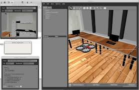
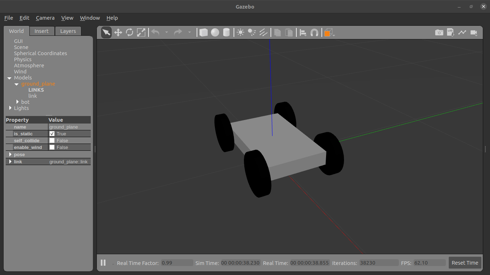
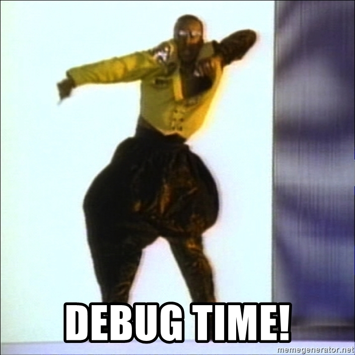

# Subpart-1

## Gazebo

<p align="center">  <i><u>A Screen shot of Gazzebo</u></i>
</p

In this subpart we will learn about Gazebo. Gazebo is a 3D dynamic simulator with the ability to accurately and efficiently simulate populations of robots in complex indoor and outdoor environments. While similar to game engines, Gazebo offers physics simulation at a much higher degree of fidelity, a suite of sensors, and interfaces for both users and programs.

Typical uses of Gazebo include:

- testing robotics algorithms,
- designing robots,
- performing regression testing with realistic scenarios

A few key features of Gazebo include:

- multiple physics engines,
- a rich library of robot models and environments,
- a wide variety of sensors,
- convenient programmatic and graphical interfaces

Enough definitions in this subpart we will simulate a robot and move it gazebo. Excited?

<div align="center">
    
</div>

### Installation

```sh
curl -sSL http://get.gazebosim.org | sh
```

then check if installation worked. Running below command should open up gazebo window.

```sh
gazebo
```

Lets first create a package to learn how to use gazebo and ROS control. Use the following commands to create catkin package with required dependencies

```bash
~/catkin_ws/src $ catkin_create_pkg gazebo_demo roscpp rospy joint_state_controller robot_state_publisher
```

and then build the workspace

```bash
~/catkin_ws $ catkin build
```

Now lets create all the required(launch, urdf, config, scripts) directories in package (notice the path in which you should run commands)

```bash
~/catkin_ws/src/gazebo_demo $ mkdir launch urdf config scripts
```

In order to simulate a bot we need a urdf of a bot, here we go [bot.urdf](../bot.urdf). Download this file and place it in urdf (`~catkin_ws/src/gazebo_demo/urdf/`) directory which we created previously.

Now that we have a bot, we need to fire up gazebo and spawn the robot in it. Lets do that using launch files. Create a launch file `fire_up.launch` in launch directory which we created previously and paste following code in it. You can see comments to understand whats the use of each line in this launch file.

```xml
<?xml version="1.0" encoding="UTF-8"?>
<launch>
    <!-- This block of code is to call empty_world.launch file to fire up gazebo with
                empty world -->
    <include file="$(find gazebo_ros)/launch/empty_world.launch">
        <arg name="paused" value="false"/>
        <arg name="use_sim_time" value="true"/>
        <arg name="gui" value="true"/>
        <arg name="headless" value="false"/>
        <arg name="debug" value="false"/>
    </include>

    <!-- This line loads urdf data of out robot -->
    <param name="robot_description" command="cat '$(find gazebo_demo)/urdf/bot.urdf'" />

    <!-- Coordinates of bot which we need to spawn -->
    <arg name="x" default="0"/>
    <arg name="y" default="0"/>
    <arg name="z" default="0.5"/>

    <!-- Calling spawing node to spawn our robot -->
    <node name="mybot_spawn" pkg="gazebo_ros" type="spawn_model" output="screen"
          args="-urdf -param robot_description -model bot -x $(arg x) -y $(arg y) -z $(arg z)" />

</launch>
```

Now launch the file

```bash
~/catkin_ws $ roslaunch gazebo_demo fire_up.launch
```


You can see gazebo window and a bot spawned in it. Something similar to this.



### If (you can see robot spawned) :
      then go ahead.
### Else:

<div align="center">
    
</div>


## ROS control

After having simulated a bot in gazebo. Now we need control to our robot and make it move, here's when ROS control comes into picture. ROS control is a set of packages that include controller interfaces, controller managers, transmissions and hardware_interfaces. You can know more about it [here](https://wiki.ros.org/ros_control).

First lets install ros-control (replace neotic with your respective ROS distribution)

```sh
sudo apt-get install ros-noetic-ros-control ros-noetic-ros-controllers
```

To use ros_control with out robot, you need to add some additional elements to your urdf. The `<transmission>` element is used to link actuators to joints, see the [spec](http://ros.org/wiki/urdf/XML/Transmission) for exact XML format. Now lets add transmission to the rear wheels in our bot leaving front wheels free to move. Add these lines to urdf (you need to add it in the robot tag).

```xml
<transmission name="tran1">
    <type>transmission_interface/SimpleTransmission</type>
    <joint name="joint_left_rear_wheel">
        <hardwareInterface>EffortJointInterface</hardwareInterface>
    </joint>
    <actuator name="left_rear_motor">
        <hardwareInterface>EffortJointInterface</hardwareInterface>
        <mechanicalReduction>1</mechanicalReduction>
    </actuator>
</transmission>

<transmission name="tran2">
    <type>transmission_interface/SimpleTransmission</type>
    <joint name="joint_right_rear_wheel">
        <hardwareInterface>EffortJointInterface</hardwareInterface>
    </joint>
    <actuator name="right_rear_motor">
        <hardwareInterface>EffortJointInterface</hardwareInterface>
        <mechanicalReduction>1</mechanicalReduction>
    </actuator>
</transmission>
```

In addition to the transmission tags, a Gazebo plugin needs to be added to your URDF that actually parses the transmission tags and loads the appropriate hardware interfaces and controller manager. By default the gazebo_ros_control plugin is very simple, though it is also extensible via an additional plugin architecture to allow power users to create their own custom robot hardware interfaces between ros_control and Gazebo. Add these lines to the urdf file (you need to add it in the robot tag).

```xml
<gazebo>
    <plugin name="gazebo_ros_control" filename="libgazebo_ros_control.so">
    <robotNamespace>/bot</robotNamespace>
    </plugin>
</gazebo>  
```

We'll next need to create a configuration file and launch file for our ros_control controllers that interface with Gazebo. Create a file `bot_control.yaml` in config directory which we created previously and paste the following in it

```yaml
bot:
  # Publish all joint states -----------------------------------
  joint_state_controller:
    type: joint_state_controller/JointStateController
    publish_rate: 50  

  # Position Controllers ---------------------------------------
  left_wheel_controller:
    type: effort_controllers/JointPositionController
    joint: joint_left_rear_wheel
    pid: {p: 100.0, i: 0.01, d: 10.0}
  right_wheel_controller:
    type: effort_controllers/JointPositionController
    joint: joint_right_rear_wheel
    pid: {p: 100.0, i: 0.01, d: 10.0}
```

Create a launch file `bot_control.launch` in the launch directory and paste following code in it

```xml
<launch>

  <!-- Load joint controller configurations from YAML file to parameter server -->
  <rosparam file="$(find gazebo_demo)/config/bot_control.yaml" command="load"/>

  <!-- load the controllers -->
  <node name="controller_spawner" pkg="controller_manager" type="spawner" respawn="false"
    output="screen" ns="/bot" args="left_wheel_controller right_wheel_controller joint_state_controller"/>

  <!-- convert joint states to TF transforms for rviz, etc -->
  <node name="robot_state_publisher" pkg="robot_state_publisher" type="robot_state_publisher"
    respawn="false" output="screen">
    <remap from="/joint_states" to="/bot/joint_states" />
  </node>

</launch>
```

Now launch the two files in two terminal

Terminal 1:

```bash
~/catkin_ws $ roslaunch gazebo_demo fire_up.launch
```

Terminal 2:

```bash
~/catkin_ws $ roslaunch gazebo_demo bot_control.launch
```

Now to see whether controllers are spawned use `rostopic list` command to list out all the topics, you should see output something similar to this

```bash
~/catkin_ws $ rostopic list
/bot/joint1_position_controller/command
/bot/joint1_position_controller/pid/parameter_descriptions
/bot/joint1_position_controller/pid/parameter_updates
/bot/joint1_position_controller/state
/bot/joint2_position_controller/command
/bot/joint2_position_controller/pid/parameter_descriptions
/bot/joint2_position_controller/pid/parameter_updates
/bot/joint2_position_controller/state
/bot/joint_states
/clock
/gazebo/link_states
/gazebo/model_states
/gazebo/parameter_descriptions
/gazebo/parameter_updates
/gazebo/performance_metrics
/gazebo/set_link_state
/gazebo/set_model_state
/rosout
/rosout_agg
/tf
/tf_static
```

so we need to publish data to `/bot/joint1_position_controller/command` topic to move left wheel. Run this command to publish data to above topic.

```bash
rostopic pub -1 /bot/joint1_position_controller/command std_msgs/Float64 "data: 1.5"
```

Now you can see robot move but the movement wont last so long. In order to continuously move bot we need to publish data continuously. Lets do that in python

Create a python file `move.py` in scripts directory and make it executable using following command.

```bash
~/catkin_ws/src/gazebo_demo/scripts$ sudo chmod +x move.py
```

Copy the following code into `move.py` file

```python
#!/usr/bin/env python3

import rospy
from std_msgs.msg import Float64
import random
import math

def main():
    rate = rospy.Rate(10) # 10hz
    lpos = 0
    rpos = 0
    left_pub = rospy.Publisher("/bot/joint1_position_controller/command",
                                            Float64, queue_size=10)
    right_pub = rospy.Publisher("/bot/joint2_position_controller/command",
                                            Float64, queue_size=10)
    while not rospy.is_shutdown():

        lpos += random.random()
        rpos += random.random()
        if random.randint(0, 4) != 0:
            left_pub.publish(lpos)
        if random.randint(0, 4) != 0:
            right_pub.publish(rpos)

        rate.sleep()

if __name__ == '__main__':
    rospy.init_node("move_node", anonymous=True)
    try:
        main()
    except rospy.ROSInterruptException:
        pass
```

Now fire up three terminals and run following commands in it

Terminal 1:

```bash
~/catkin_ws$ roslaunch gazebo_demo fire_up.launch
```

Terminal 2:

```bash
~/catkin_ws$ roslaunch gazebo_demo bot_control.launch
```

Terminal 3:

```bash
~/catkin_ws$ rosrun gazebo_demo move.py
```

Now you can see bot moving randomly. Something like this

https://user-images.githubusercontent.com/67263028/126157846-32fedd5e-2d97-4638-bdab-a30dbb9cf340.mp4


This is basically what you would do to control a robot with ROS for using a robot. Remain thing remains the same to what you would have done in any other simulator like `pyBullet`. For getting you comfortable with the gazebo api's we will have a small excercise with you all.

## (Misc.) Task for the Subpart

In this task you will have to add a camera to the simulator and control your robot using that. Lets use the gazebo_demo package created earlier.

#### Adding Camera in the world file (Compulsory)

Basically if you dont know yet `.world` files are responsible for loading world and objects in them in gazebo_ros

so lets make one
```bash
user@master :~/catkin_ws/src/gazebo_demo$ mkdir world
user@master :~/catkin_ws/src/gazebo_demo$ cd world
user@master :~/catkin_ws/src/gazebo_demo$ touch mc_duniya.world

## Open the mc_duniya.world using any text editor of your choice
```
I would recommend you to write down each line of code one by one rather using ctrl + v ctrl + c
<script> function oncl(){alert("hi");}</script>
<button onclick=oncl()> Click me </button>

```xml
<?xml verison='1.0' ?>
<sdf version='1.6'>
  <world name='default'>
    <light name='sun' type='directional'>
      <cast_shadows>1</cast_shadows>
      <pose frame=''>0 0 10 0 -0 0</pose>
      <diffuse>0.8 0.8 0.8 1</diffuse>
      <specular>0.2 0.2 0.2 1</specular>
      <attenuation>
        <range>1000</range>
        <constant>0.9</constant>
        <linear>0.01</linear>
        <quadratic>0.001</quadratic>
      </attenuation>
      <direction>-0.5 0.1 -0.9</direction>
    </light>
    <model name='ground_plane'>
      <static>1</static>
      <link name='link'>
        <collision name='collision'>
          <geometry>
            <plane>
              <normal>0 0 1</normal>
              <size>100 100</size>
            </plane>
          </geometry>
          <surface>
            <contact>
              <collide_bitmask>65535</collide_bitmask>
              <ode/>
            </contact>
            <friction>
              <ode>
                <mu>100</mu>
                <mu2>50</mu2>
              </ode>
              <torsional>
                <ode/>
              </torsional>
            </friction>
            <bounce/>
          </surface>
          <max_contacts>10</max_contacts>
        </collision>
        <visual name='visual'>
          <cast_shadows>0</cast_shadows>
          <geometry>
            <plane>
              <normal>0 0 1</normal>
              <size>100 100</size>
            </plane>
          </geometry>
          <material>
            <script>
              <uri>file://media/materials/scripts/gazebo.material</uri>
              <name>Gazebo/Grey</name>
            </script>
          </material>
        </visual>
        <self_collide>0</self_collide>
        <enable_wind>0</enable_wind>
        <kinematic>0</kinematic>
      </link>
    </model>
    <gravity>0 0 -9.8</gravity>
    <magnetic_field>6e-06 2.3e-05 -4.2e-05</magnetic_field>
    <atmosphere type='adiabatic'/>
    <physics name='default_physics' default='0' type='ode'>
      <max_step_size>0.001</max_step_size>
      <real_time_factor>1</real_time_factor>
      <real_time_update_rate>1000</real_time_update_rate>
    </physics>
    <scene>
      <ambient>0.4 0.4 0.4 1</ambient>
      <background>0.7 0.7 0.7 1</background>
      <shadows>1</shadows>
    </scene>
    <wind/>
    <spherical_coordinates>
      <surface_model>EARTH_WGS84</surface_model>
      <latitude_deg>0</latitude_deg>
      <longitude_deg>0</longitude_deg>
      <elevation>0</elevation>
      <heading_deg>0</heading_deg>
    </spherical_coordinates>
    <state world_name='default'>
      <sim_time>28 582000000</sim_time>
      <real_time>28 656851908</real_time>
      <wall_time>1627221536 222944540</wall_time>
      <iterations>28582</iterations>
      <model name='ground_plane'>
        <pose frame=''>0 0 0 0 -0 0</pose>
        <scale>1 1 1</scale>
        <link name='link'>
          <pose frame=''>0 0 0 0 -0 0</pose>
          <velocity>0 0 0 0 -0 0</velocity>
          <acceleration>0 0 0 0 -0 0</acceleration>
          <wrench>0 0 0 0 -0 0</wrench>
        </link>
      </model>
      <light name='sun'>
        <pose frame=''>0 0 10 0 -0 0</pose>
      </light>
    </state>
    <gui fullscreen='0'>
      <camera name='user_camera'>
        <pose frame=''>3.96547 -3.06012 3.49372 0 0.603643 2.32419</pose>
        <view_controller>orbit</view_controller>
        <projection_type>perspective</projection_type>
      </camera>
    </gui>
  </world>
</sdf>
```

This contains defualt environment
- A sun
- A plane

And a few details about the physics solver.
Put this in your `mc_duniya.world` file and then change the path of world file you are launching with for doing this edit fire_up.launch file

```xml
<!--fire_up.launch-->
<?xml version="1.0" encoding="UTF-8"?>
<launch>
    <!-- This block of code is to call empty_world.launch file to fire up gazebo with
                empty world -->
    <include file="$(find gazebo_ros)/launch/empty_world.launch">
        <arg name="world_name" value="$(find gazebo_demo)/world/mc_duniya.world" /> <!--This will load the mc_duniya.world-->
        <arg name="paused" value="false"/>
        <arg name="use_sim_time" value="true"/>
        <arg name="gui" value="true"/>
        <arg name="headless" value="false"/>
        <arg name="debug" value="false"/>
    </include>
```
Now lets add the definition of the camera. Basically everything in gazebo is just a plugin that maybe any sensor, Actuator, Or interactable object.

**For tutorial For Camera Plugin** [[Head out]](http://gazebosim.org/tutorials?tut=ros_gzplugins#Camera).  

Basically you will be adding this code in the `.world` file
```xml
  <gazebo reference="camera_link">
    <sensor type="camera" name="camera1">
      <update_rate>30.0</update_rate>
      <camera name="head">
        <horizontal_fov>1.3962634</horizontal_fov>
        <image>
          <width>800</width>
          <height>800</height>
          <format>R8G8B8</format>
        </image>
        <clip>
          <near>0.02</near>
          <far>300</far>
        </clip>
        <noise>
          <type>gaussian</type>
          <!-- Noise is sampled independently per pixel on each frame.
               That pixel's noise value is added to each of its color
               channels, which at that point lie in the range [0,1]. -->
          <mean>0.0</mean>
          <stddev>0.007</stddev>
        </noise>
      </camera>
      <plugin name="camera_controller" filename="libgazebo_ros_camera.so">
        <alwaysOn>true</alwaysOn>
        <updateRate>0.0</updateRate>
        <cameraName>gazebo_demo/camera</cameraName>
        <imageTopicName>image_raw</imageTopicName>
        <cameraInfoTopicName>camera_info</cameraInfoTopicName>
        <frameName>camera_link</frameName>
        <hackBaseline>0.07</hackBaseline>
        <distortionK1>0.0</distortionK1>
        <distortionK2>0.0</distortionK2>
        <distortionK3>0.0</distortionK3>
        <distortionT1>0.0</distortionT1>
        <distortionT2>0.0</distortionT2>
      </plugin>
    </sensor>
  </gazebo>
```
(Figure out the location and few parameters)
-[ ] You would have to make a link and connect this camera to that link with a joint.

There are multiple parameters whose description can be looked up in the above link.

Now this would give you a new topic `/gazebo_demo/camera`

This would contain the image in a compressed format you can use this input to control your robot. Consider putting your camera in a overhead fashion as given below.


<p align="center"> <i> Task2 : Subpart1 Overhead coordinates</i></p>

Hoping if you have followed along and have finished till here you can launch the world and check using this command.

```bash
user@master :~$ roslaunch gazebo_demo fire_up.launch
```

You can check the image output in rviz by opening it in a new terminal.
```bash
user@master :~$ rosrun rviz rviz
```
And adding the message from the camera in rviz you can go through the video below.


[](https://youtu.be/UMEE5HYQ8VU?t=164)


#### Getting feed from the camera.

Now after having the camera spawned and getting its data published on  a topic we can use this in our code.
- [ ] Use cv_bridge for accessing images from a camera.


```bash
user@master :~$ cd catkin_ws/src/gazebo_demo
user@master :~/catkin_ws/src/gazebo_demo$ mkdir src
user@master :~/catkin_ws/src/gazebo_demo$ cd src
user@master :~/catkin_ws/src/gazebo_demo$ touch image_display.cpp ## or image_display.py
```

this depends on you the language you prefer.
for cpp you have tutorial here [[c++]](http://wiki.ros.org/cv_bridge/Tutorials/UsingCvBridgeToConvertBetweenROSImagesAndOpenCVImages) and for [[python]](http://wiki.ros.org/cv_bridge/Tutorials/ConvertingBetweenROSImagesAndOpenCVImagesPython)


After doing this just include <cv_bridge> in the `CMakeLists.txt` and `package.xml`.

By following this you will have a simple display of the the camera.

#### Controlling the robot using OpenCV.

After getting the input of the camera from overhead camera we can roughly control the robot with this data as we have `/joint_states` from the controller and it is not difficult for one to calculate the position of the robot using the angles of the wheels.

**L1 = R*O1** where L1 is the distance travelled by COM of Wheel1 where R is radius and O1 is the angle rotated got from the `/joint_states`.

**Note: This is just a good model in a simulator where you have exact value about the angle but in real world this is very erroneous**

- [ ] This is a bonus task as we assume OpenCV as a prerequisite to controll the robot as after thresholding it with the camera ( hope you had personalized the robot to your liking by changing it's color ). As this is more robust than the previously said method and you may just threshold based on color and not aruco markers.

Here you have to control the robot to come right below the camera. Assuming it was placed far from the center of the camera's sight but is inside the sight of the camera.

### Submission
You have to submit a video in which your terminal is visible with your username. And show a OpenCV window in which the robot is visible moving. (In the video the robot may not be going to the center of the camera's sight but maybe randomly moving if you were not able to complete the bonus task. If you did congrats submit a video with the robot moving towards the center with great precision).
