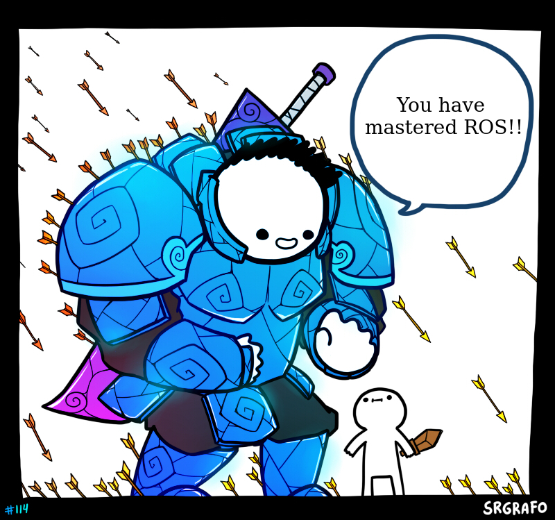

# Conclusion

At last...

  

Now you have completed the basic Course about ROS and you are ready to do robotics with your knowledge of ROS.

## PROJECT-CUM-TASK
This is open to you on how you wanna approach this with project.

Contraints
- Project Should I have a simple approachable target.
- Your Project should not take more than 1 Week of time to complete.
- You can have at max 4 people in your team.
- You have to maintain Github Repository for your ROS Package and should contain a `Readme.md` with installation instructions.

#### Sample Problem Statement.

Carrying load on top of the robot for uneven terrain.

Which is very difficult to accomplish but your objective may be much simpler but should have a value in the real world

## Metrics and Prizes

We rate all the projects as good :star: , very good :star2: , nice :nerd_face: (in no particular order).

Basically we are happy to see you people work hard on your projects.

And Feel free to combine this project with any other specilization you may be currently taking up in the SummerCamp.

**For out-of-the-box performer(**/**team)**

 </img>

We will try to help them get there bots in Real world. And would give guidance and a considerable funds for proceeding with the project. So don't miss the golden chance and impress us with your creative skills on applying this technology.

you are allowed to use any package extensively. We would aslo be happy to take projects where you didnt code any algorithm but just applied multiple pre-exisitng packages and get the output which justifies your problem statement.

**Submission Deadline** : 2 Aug 2021 EOD (Non Negotiable and as the task doesn't have a objective you have to produce what ever result you get till this time).

<h2 align="center">Congratulations!!!</h2>

For Completing our specilization hope you enjoyed and as the content is open Spread it to whom ever can benefit from it. And try Contributing back to the community by add content suggests( theses are handled in the issue and Pull requests section of the repository). You can aslo help your fellow batchmates by solving doubts and giving them hints.

<h2 align="center">Signing Off</h2>
<h4 align="center">Team ROS</h4>

<table align="center">
 <td align="center">
     <a href="https://github.com/hex-plex">
     <b>Somnath Sendhil Kumar </b></a> 
    </td>
    <td align="center">
     <a href="https://github.com/vstark21">
     <b>Chepuri Vishwas</b></a> 
	</td>
	<td align="center">
     <a href="https://github.com/Amshra267">
     <b>Aman Mishra</b></a> 
	</td>

</table>

